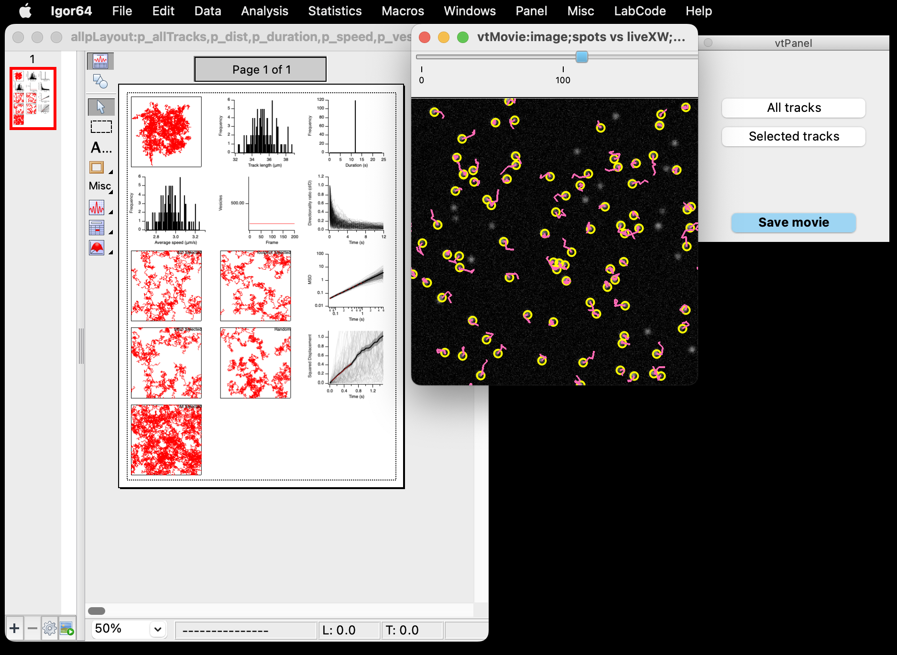
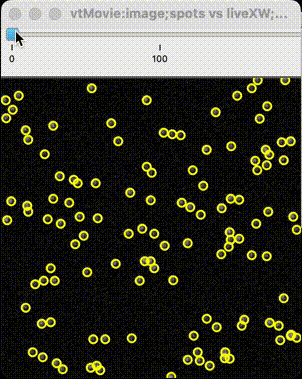

# p063p036

Code and data for Sittewelle & Royle manuscript `#p063p036`

**Passive diffusion accounts for the majority of intracellular nanovesicle transport**

Méghane Sittewelle & Stephen J. Royle

*Life Sci Alliance* 2023. DOI: [hhttps://doi.org/10.26508/lsa.202302406](https://doi.org/10.26508/lsa.202302406)

## plots

R code for plot recreation.
For details, see the README in `plots/`

- Several R scripts require **TrackMateR** to run.
Stable release is [here](https://doi.org/10.5281/zenodo.7042948), development version is [here](https://github.com/quantixed/TrackMateR).
- Some R scripts require TrackMate XML files to process data and generate plots.
These files are available at [Zenodo](https://doi.org/10.5281/zenodo.7905013) together with some of the visualizations generated using TrackMateR.

## simulations

### Modelling particle diffusion

For FLIP simulation, `DiffusionSim.ipf` is written for IGOR Pro.

	
A GUI is available to guide simulations. Click for details...

	

- Most variables are self-explanatory, please note the units.
- *FLIP mode* selects between a circle (used in the paper), square or a ring.
- *Random start location* when checked will start vesicles at random locations throughout the cell. When unchecked, vesicles will start at the cell centre.
- Specify bleach location for circle, square and ring. FlipRingR stipulates the radius of the ring (intended to be used without Random start location checked) so that vesicles diffuse away from the origin before entering the ring. For square specify the left-top (LT) and right-bottom (RB) XY locations relative to the cell centre `(0,0)`. For circle, an offset can be specified as well as a radius.
- *Simulate* will show the movement of vesicles without FLIP
- *FLIP* will do a single FLIP simulation
- *FLIP Rep* will do repeated FLIP simulations
- *Visualise* if checked will show the tracks when FLIP Rep is clicked.

The bottom part of the panel allows the simulations to be automated by taking a variable number of steps from a start and stop point for FLIP circle radius and for the diffusion coefficient (as described in the paper. Click *Automate* to start after setting all parameters.

### Simulating particle diffusion and benchmarking TrackMate

Particle movies were generated using `Particle_Simulation.ijm` in FIJI.
TrackMate automation is via the groovy script `TrackMateAutomation.groovy`.
The ground truth outputs can be evaluated in IGOR using `VesicleTracks.ipf`.
Select *Macros > Vesicle Tracks Only* or *Macros > Vesicle Tracks Simple* and select the csv file of the ground truth data that you would like to evaluate.
The "simple" workflow skips algorithmic comparison of tracks and other features which are not necessary for evaluating the ground truth data.

	
Although not documented in the paper, `VesicleTracks.ipf` will also display movies and tracking data in a neat widget for visualization. Click for details...

	

To use this, select *Macros > Vesicle Tracks...* As an input it requires a csv file of tracks and an image.
This is compatible with the outputs from `Particle_Simulation.ijm` but the display will show all particles in the volume.

The default view shows all particles. Click "show selected" to see the top most directed tracks according to the program. 

The TrackMate XML outputs can be analyzed using `TrackMateR`.
R code to evaluate TrackMate XML files from these routines is available in `plots/SJR194/`.

Some IGOR procedure files require `PXPUtils.ipf` to run properly, available [here](https://github.com/quantixed/PXPUtils).